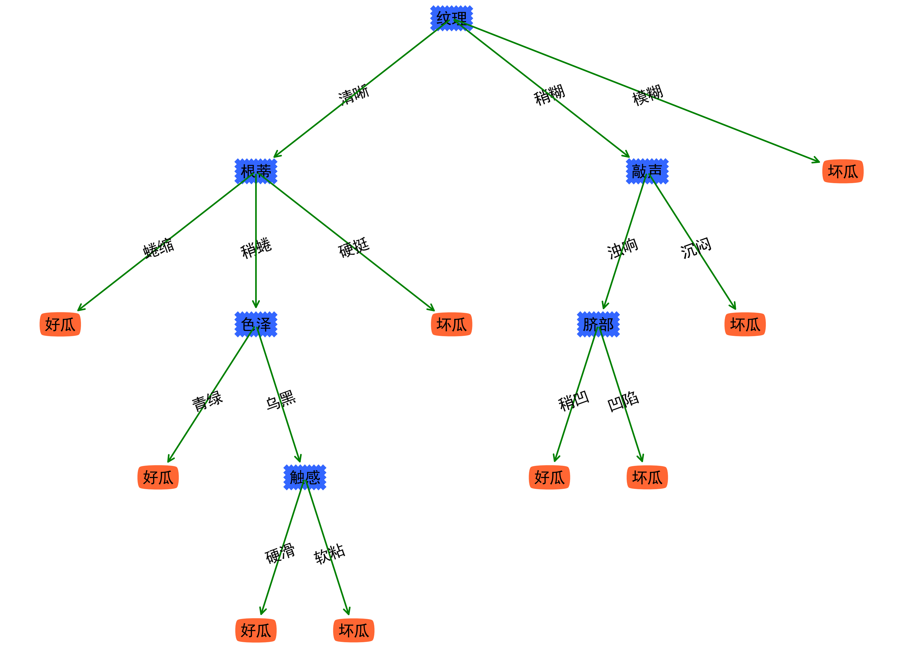

# CSDN_blog_code
存放CSDN博客中的一些源代码，内容有时间会不断上传完善，文件夹结构会随着内容增加而发生更改

> **如果有帮助的话希望大家点一下右上角的Star**
# 课程设计
## 失物招领系统
- [C++](课程设计/失物招领系统/C++)
  > 博客地址：https://blog.csdn.net/qq_36949278/article/details/123670203
- [LabVIEW](课程设计/失物招领系统/LabVIEW)
  > 博客地址：https://blog.csdn.net/qq_36949278/article/details/105565583

## 模糊PID
- [Simulink](课程设计/模糊PID控制/Simulink)
  > 博客地址：https://blog.csdn.net/qq_36949278/article/details/105569943
- [LabVIEW](课程设计/模糊PID控制/LabVIEW)
  > 博客地址：https://blog.csdn.net/qq_36949278/article/details/105521599

# 课后作业
## 机器学习
- [对率回归决策树](课后作业/机器学习/对率回归决策树)
  > 博客地址：https://blog.csdn.net/qq_36949278/article/details/89597491 

 

- [A\*算法求解迷宫寻路问题（启发式算法）](课后作业/机器学习/A\*算法迷宫寻路)
  > 博客地址：https://blog.csdn.net/qq_36949278/article/details/109255204

